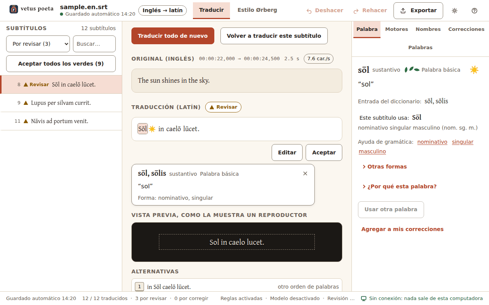
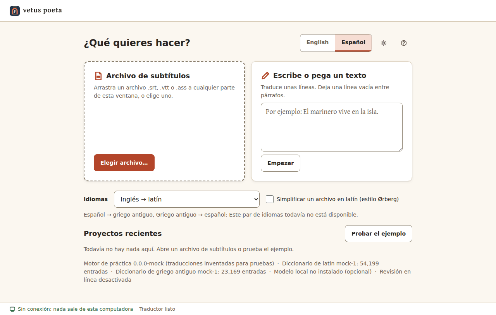
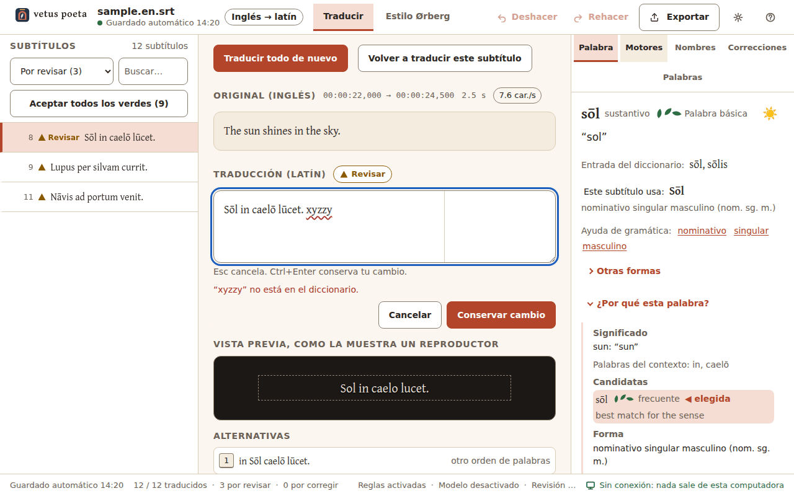
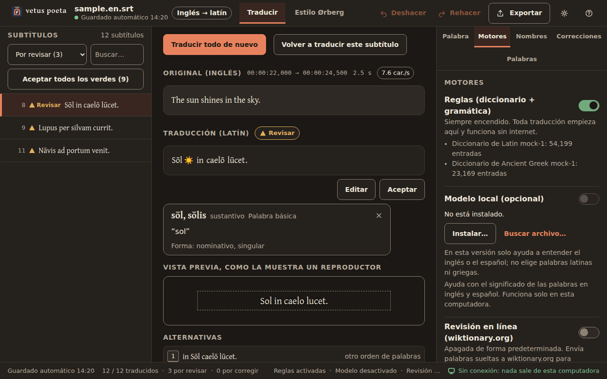
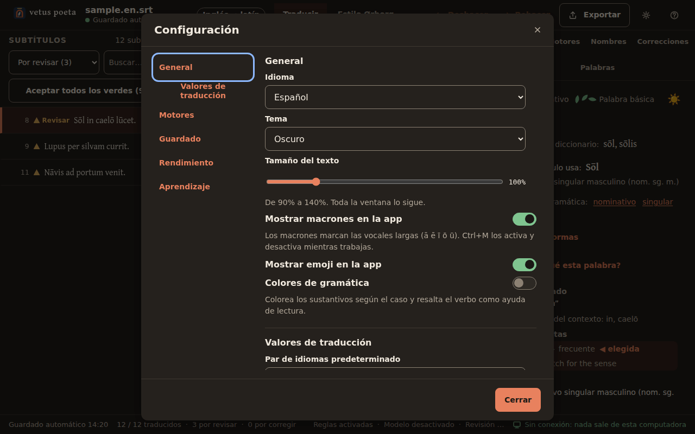
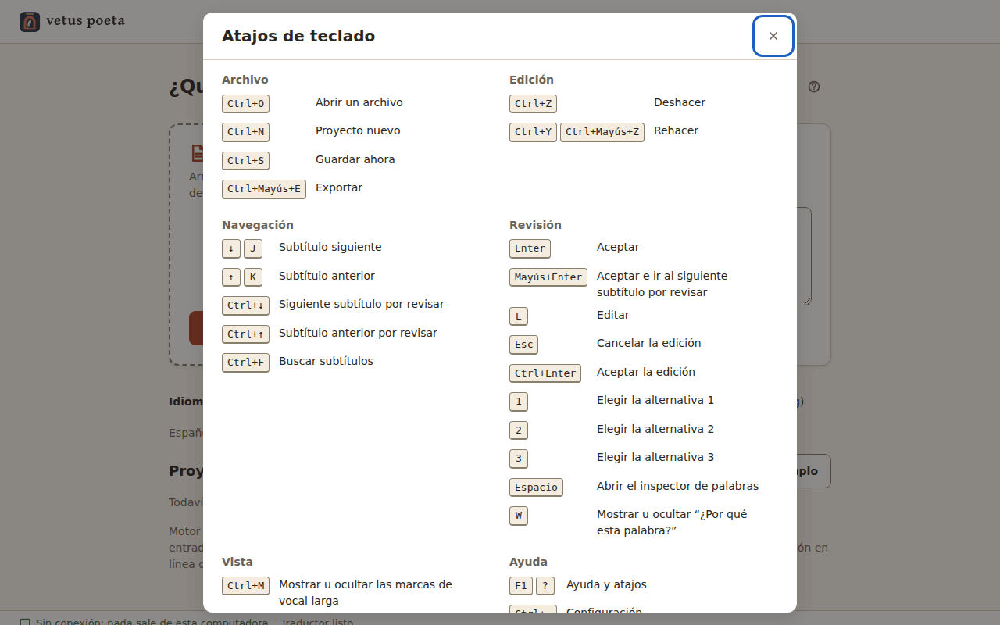

# Guía de uso de vetus poeta

*Versión 0.1.0 · [English version](USER_GUIDE.md)*

vetus poeta traduce subtítulos y textos cortos entre el inglés o el español y el latín, en tu propia computadora y
sin internet. Escribe un latín que puede seguir alguien en su primer año de estudio, y nunca adivina en silencio:
cada subtítulo lleva una marca que dice qué tan seguro está, y cada palabra puede explicarte por qué se eligió.
Está hecho para un docente de latín y sus estudiantes.



*El espacio de trabajo con el ejemplo incluido, en el motor de práctica (traducciones inventadas para pruebas).*

## Contenido

1. [Qué hace vetus poeta](#1-qué-hace-vetus-poeta)
2. [Instalación](#2-instalación)
3. [La pantalla de inicio](#3-la-pantalla-de-inicio)
4. [El espacio de trabajo](#4-el-espacio-de-trabajo)
5. [La pestaña Palabra y "¿Por qué esta palabra?"](#5-la-pestaña-palabra-y-por-qué-esta-palabra)
6. [Del latín al español o al inglés: la vista interlineal](#6-del-latín-al-español-o-al-inglés-la-vista-interlineal)
7. [La pestaña Motores y el control de fidelidad](#7-la-pestaña-motores-y-el-control-de-fidelidad)
8. [Nombres, correcciones y palabras del archivo](#8-nombres-correcciones-y-palabras-del-archivo)
9. [Estilo Ørberg](#9-estilo-ørberg)
10. [Modo de texto](#10-modo-de-texto)
11. [Exportar](#11-exportar)
12. [Configuración](#12-configuración)
13. [Guardado, guardado automático y recuperación](#13-guardado-guardado-automático-y-recuperación)
14. [Atajos de teclado](#14-atajos-de-teclado)
15. [Si algo falla](#15-si-algo-falla)
16. [La garantía sin conexión](#16-la-garantía-sin-conexión)
17. [Computadora mínima](#17-computadora-mínima)
18. [Fuentes de datos y licencias](#18-fuentes-de-datos-y-licencias)

## 1. Qué hace vetus poeta

Tiene dos trabajos principales:

- **Subtítulos al latín.** Abres un archivo de subtítulos en español o en inglés (`.srt`, `.vtt`, `.ass`) y obtienes
  uno en latín. La numeración, los tiempos y los códigos de formato (`<i>`, `{\an8}`, bloques de estilo ASS) se
  copian byte por byte; solo cambian las líneas de texto. Las líneas se vuelven a cortar para la pantalla
  (42 caracteres, máximo 2 líneas).
- **Del latín al español o al inglés.** Abres un archivo en latín o pegas un texto latino y obtienes una
  traducción legible y, además, la **vista interlineal**: bajo cada palabra latina, su forma de diccionario, su
  forma explicada y su significado.

Qué está listo en la versión 0.1.0:

| Par de idiomas | Estado |
|---|---|
| Español → latín, inglés → latín | listo |
| Latín → español, latín → inglés | listo |
| Español/inglés → griego antiguo, griego antiguo → español/inglés | todavía no: aparece como "no disponible" |
| Estilo Ørberg (latín → latín más sencillo) | todavía no: la pantalla existe, pero el motor responde que todavía no puede |

**¿Qué tan bien traduce?** Números honestos, medidos en la computadora de desarrollo el 06/10/2026:

- Con nuestro archivo de 100 oraciones propias en español, el latín coincide con la traducción de referencia en
  97 de 100 subtítulos (después se aceptaron las 3 restantes como respuestas alternativas). Con la versión en
  inglés de 114 oraciones, coincide en 114 de 114 (110 antes de aceptar cuatro respuestas alternativas). **Con
  estos archivos se ajustaron las reglas**, así que los números favorecen al motor.
- Latín → español y latín → inglés: 125 de 125 oraciones propias correctas en los dos idiomas, también después de
  ajustar; un grupo de 30 oraciones escritas más tarde salió bien en 20 de 30 al primer intento.
- Con textos que el motor nunca ha visto le irá peor. Ese número (la prueba con textos reservados) **todavía no se
  mide**, y el archivo de película del docente, que es la prueba de aceptación real, todavía no llega.
- La comparación lado a lado con Google Translate está planeada, pero todavía no se hace.

Así que toma cada traducción como un borrador por revisar. Las marcas de la lista te dicen por dónde empezar.

## 2. Instalación

vetus poeta es una carpeta portátil; no tiene instalador. Copia la carpeta `vetus-poeta` donde quieras (por
ejemplo `C:\Programas\vetus-poeta`) y abre **VetusPoeta.exe**. Esto es lo que contiene:

```
VetusPoeta.exe        la ventana                      vpengine.exe          el traductor
WebView2Loader.dll    lo necesita la ventana          ui\                   la interfaz
data\*.vpl            diccionarios de latín, griego, inglés y español (unos 206 MB)
data\nlp\             analizadores de oraciones en inglés y español  data\curated\   tablas de palabras
samples\              los archivos de ejemplo (oraciones propias)    models\         el modelo opcional
THIRD_PARTY_NOTICES.txt  todas las licencias                          licenses\
```

La carpeta completa pesa unos 240 MB sin el modelo.

- **Microsoft Edge WebView2 Runtime.** Es lo que dibuja la ventana. Windows 10 (actualizado) y Windows 11 ya lo
  traen. Si falta, vetus poeta te avisa y te ofrece abrir la página de descarga de Microsoft; es la única vez que
  abre una página web por su cuenta. El instalador "Standalone" x64 de Microsoft funciona también en una
  computadora sin internet.
- **Diccionarios.** Los cuatro archivos `.vpl` deben quedarse en `data\`. Si falta el de latín, la pantalla de
  inicio muestra una tarjeta roja con la ruta exacta donde lo esperaba.
- **Modelo local (opcional).** Es un solo archivo, `Qwen2.5-0.5B-Instruct-Q4_K_M.gguf`, de 397,808,192 bytes (unos
  400 MB), con licencia Apache-2.0. Te lo da tu docente o la página de descarga; vetus poeta nunca lo descarga.
  Ponlo en `models\` junto a `vpengine.exe`, o en cualquier carpeta y elígelo con **Buscar archivo…** en la pestaña
  Motores. La app revisa su huella SHA-256
  (`6eb923e7d26e9cea28811e1a8e852009b21242fb157b26149d3b188f3a8c8653`) y muestra el resultado en
  Configuración > Motores; si es otro archivo, lo rechaza. Todo funciona sin él.
- **Tus archivos** (configuración, guardados automáticos, registro, caché en línea) están en
  `%LOCALAPPDATA%\vetus-poeta\`.

## 3. La pantalla de inicio



- **Archivo de subtítulos**: arrastra un archivo `.srt`, `.vtt` o `.ass` a cualquier parte de la ventana, o usa
  **Elegir archivo…**. También abre un `.txt` o un proyecto guardado (`.vpoeta`).
- **Escribe o pega un texto**: unas líneas para traducir rápido (ver [Modo de texto](#10-modo-de-texto)).
- **Idiomas**: el par, por ejemplo *Español → latín*. Los pares que todavía no están listos aparecen debajo con el
  motivo, para que tus estudiantes vean lo que viene.
- **Simplificar un archivo en latín (estilo Ørberg)**: la casilla para el [Estilo Ørberg](#9-estilo-ørberg).
- **Proyectos recientes** (hasta 20) y **Probar el ejemplo**: un archivo de 12 subtítulos con oraciones propias
  para explorar.
- **English | Español** cambia el idioma de la interfaz al instante; el engrane abre la Configuración; **?** abre
  los atajos, el recorrido y "Acerca de".
- La línea de estado de abajo dice si el traductor, cada diccionario, el modelo y la revisión en línea están listos.

Tras un cierre inesperado verás **Encontramos trabajo de tu última sesión.** con **Recuperar** (predeterminado) y
**Conservar la versión guardada**.

## 4. El espacio de trabajo

- **Barra superior**: el nombre del archivo y si está guardado, el par de idiomas, las pestañas
  **Traducir | Estilo Ørberg**, **Deshacer**, **Rehacer**, **Exportar**, el engrane de configuración y **?**. Al
  hacer clic en el logotipo se cierra el proyecto.
- **Lista de subtítulos** (izquierda): número, marca y primera línea de cada uno. El filtro muestra **Todos**,
  **Por revisar**, **Solo por corregir**, **Editados por mí**, **Con emoji**, **Superan la velocidad de lectura** o
  **Nombres desconocidos**; **Buscar…** busca en el original y en la traducción, con o sin macrones.
  **Aceptar todos los verdes (n)** acepta de una vez todos los que están bien (y se puede deshacer).
- **Original** (arriba al centro): el subtítulo original con sus tiempos, duración y caracteres por segundo. Los
  códigos de formato se ven como pequeñas etiquetas grises y se conservan tal cual. Haz clic en una palabra del
  original para ver qué significado se usó.
- **Traducción**: cada palabra es un botón. **Editar** (o `E`) la vuelve un cuadro de texto: `Esc` cancela,
  `Ctrl+Enter` conserva tu cambio y las palabras desconocidas se subrayan en rojo. **Aceptar** (`Enter`) marca el
  subtítulo como revisado.
- **Vista previa, como la muestra un reproductor**: el subtítulo tal como quedará en el archivo exportado (según
  Exportar: macrones, emoji, cortes de línea), con un aviso si una línea pasa de 42 caracteres o si es demasiado
  rápido para leerlo.
- **Alternativas**: hasta 3 formas más de decirlo, con su motivo ("palabras más sencillas", "otro orden de
  palabras", "de tus correcciones"...). Presiona `1`, `2` o `3` para usar una; el texto anterior pasa a las
  alternativas, así que no se pierde nada.
- **Barra de estado**: si está guardado, cuántos subtítulos están traducidos, por revisar y por corregir, qué
  motores están encendidos y el indicador de red **Sin conexión: nada sale de esta computadora** (o
  **Revisión en línea activada**, en ámbar).

**Las tres marcas** (forma, color y palabra; nunca solo el color):

| Marca | Qué significa |
|---|---|
| ● círculo verde, **Bien** | todas las palabras se conocen, pasan todas las revisiones y no hay dudas por encima del límite |
| ▲ triángulo amarillo, **Revisar** | conviene revisarlo: dos significados posibles, un nombre o un destinatario adivinado, una oración que el analizador tuvo que reparar, un problema de velocidad de lectura, una palabra rara cuando había una básica |
| ■ cuadrado rojo, **Corregir** | probablemente tiene un error: una palabra desconocida, una concordancia o un caso que no pasa la revisión, una oración original que no se entendió |

**Cómo revisar.** Después de **Traducir**, la lista se abre en el primer subtítulo por revisar. Muévete con
`↓`/`↑` (o `J`/`K`); `Ctrl+↓` salta al siguiente por revisar; `Enter` acepta y `Mayús+Enter` acepta y avanza.
Cuando ya no queda nada, la app dice **Revisaste todos los subtítulos. ¿Exportar?** Una nueva traducción nunca
sobrescribe los subtítulos que editaste o aceptaste; si cambias un motor, los demás reciben un punto gris
("desactualizado") hasta que los vuelvas a traducir.

## 5. La pestaña Palabra y "¿Por qué esta palabra?"



Haz clic en cualquier palabra latina (o presiona `Espacio` sobre ella). Una tarjeta pequeña muestra la forma de
diccionario, el significado y la forma; la pestaña **Palabra** de la derecha muestra más:

- la palabra con sus macrones, la categoría gramatical, el nivel (tres hojas de laurel: **Palabra básica**; dos:
  **Palabra común**; una: **Palabra poco común**) y un emoji si el sustantivo se puede dibujar;
- **Entrada del diccionario:**, **Este subtítulo usa:** con la forma primero en palabras y luego abreviada
  ("acusativo singular (ac. sg.)"), y los enlaces de **Ayuda de gramática:** con un párrafo por término;
- **Otras formas**: la tabla completa, con la forma de este subtítulo resaltada;
- **¿Por qué esta palabra?** (`W`), siempre con los mismos cuatro bloques: **Significado** (qué sentido de la
  palabra en español o en inglés y qué palabras del contexto se usaron), **Candidatas** (las palabras que se
  consideraron, con su nivel y frecuencia; la **elegida** va marcada), **Forma** (por qué este caso, número,
  persona...) y **Fuentes** (Wiktionary, Whitaker's Words, modelo local, revisión en línea: **coincide**,
  **no coincide**, **apagada**). Debajo están las revisiones del subtítulo (forma conocida, concordancia, caso
  según el verbo o la preposición, nivel de palabras, no falta nada, velocidad de lectura...). Cada línea viene
  del motor; la ventana no inventa nada;
- **Usar otra palabra** (eliges una candidata y el subtítulo queda en Revisar hasta que se revise otra vez) y
  **Agregar a mis correcciones**.

## 6. Del latín al español o al inglés: la vista interlineal


Elige *Latín → español* o *Latín → inglés* y abre un archivo en latín (el ejemplo también sirve). El original
tiene un botón **Interlineal** (`Ctrl+I`): bajo cada palabra latina aparecen su forma de diccionario, su forma
("ac. sg.") y su significado. Haz clic en una palabra latina para ver su **Función en la oración** (sujeto, objeto
directo...) y **¿Por qué esta lectura?**, que muestra cómo se leyó la palabra, qué otras lecturas permite esa forma
y qué tan seguro está el motor. La primera alternativa de cada subtítulo es una traducción **palabra por palabra**.

## 7. La pestaña Motores y el control de fidelidad



*Captura del motor de práctica: los tamaños de los diccionarios son inventados.*

- **Reglas (diccionario + gramática)**: siempre encendido. Aquí se escribe toda traducción, y siempre igual (el
  mismo archivo con la misma configuración da exactamente el mismo resultado).
- **Modelo local (opcional)**: un modelo de lenguaje pequeño que funciona en esta computadora; se carga solo
  mientras traduce y luego se descarga de la memoria. **En esta versión solo ayuda a entender el inglés o el
  español; no elige palabras latinas ni griegas.** Responde preguntas cerradas, por ejemplo cuál de los
  significados del diccionario le queda a una palabra en esa oración, y nunca escribe latín. Probamos si sabía
  distinguir una oración latina correcta de una con un error: acertó en el 74.9 % de 1,000 pares, apenas abajo del
  75 % fijado antes de la prueba, así que no se usa del lado latino. Con el modelo la traducción es mucho más lenta;
  todavía no se mide en un i3.
- **Revisión en línea (wiktionary.org)**: apagada de forma predeterminada. Encendida, el motor consulta en
  wiktionary.org la forma de diccionario de palabras latinas sueltas y agrega la respuesta a **Fuentes**. Nunca
  cambia tu texto; solo puede bajar una marca a Revisar. Al encenderla aparece una vez **Qué sale de la
  computadora**. Necesita dos interruptores: este y **Consultar wiktionary.org** en Configuración > Motores.
  **Probar la conexión** hace una prueba.

**¿Qué tan fiel al original?** El control tiene tres posiciones. Cambia qué palabras puede usar el motor; el
significado nunca se sacrifica.

| Posición | Qué cambia |
|---|---|
| **Muy fiel: cualquier palabra necesaria** | todo el diccionario, para elegir la palabra exacta aunque sea rara |
| **Equilibrado: palabras frecuentes** (predeterminado) | palabras clásicas frecuentes; evita las raras |
| **Flexible: palabras básicas, puede reformular** | palabras básicas (nivel *Familia Romana*), y puede reformular la oración |

Ejemplos de nuestros archivos de prueba, tal como los tradujo el motor el 06/10/2026:

| Original | Muy fiel | Equilibrado | Flexible |
|---|---|---|---|
| Cayó en un hoyo profundo. | In foveam profundam cecidit. | In foveam altam cecidit. | In foveam altam cecidit. |
| You must be, or you wouldn't be here. (archivo en inglés) | Certē es; aliter hīc nōn essēs. | Certē es; aliter hīc nōn essēs. | Certē es; aliter hīc nōn es. |

En el archivo de 100 oraciones en español, 13 subtítulos cambian entre las dos primeras posiciones y ninguno entre
las dos últimas; Equilibrado dio más marcas Bien (78, contra 67 y 51). Una línea bajo el control dice el efecto con
números.

- **Emoji después de los sustantivos dibujables (en la app)**: un emoji solo después de un sustantivo con un dibujo
  claro (🌹 después de *rosam*); ninguno si el sustantivo tiene varios significados. `Ctrl+E` los oculta o muestra.
- **Macrones en el archivo exportado**: el valor predeterminado de Exportar. En la app los macrones se ven a menos
  que los ocultes (`Ctrl+M`).
- **Traducir de nuevo**: **Subtítulo seleccionado** o **Todos los subtítulos**. Los que editaste o aceptaste se
  conservan tal como están.

## 8. Nombres, correcciones y palabras del archivo


- **Nombres**: el glosario de nombres propios. **Agregar un nombre** como aparece en el archivo y elige
  **Conservar** (igual que en el original), **Declinar** (con terminaciones latinas: Marcus, Marcī) o **Traducir**,
  con **Forma latina**, **Género** y **Declinación**. **Aplicar** vuelve a traducir solo los subtítulos que tienen
  ese nombre. **Copiar como CSV** copia la lista al portapapeles.
- **Correcciones**: cuando editas un subtítulo, la app pregunta **¿Recordar este cambio?** **Esta frase** guarda
  "frase original → tu latín" y la aplica antes que las reglas en los siguientes subtítulos (el motivo dice entonces
  **De tus correcciones.**); **Solo este subtítulo** deja el cambio únicamente en ese subtítulo. La pestaña muestra cada corrección con las
  veces que se aplicó y un botón **Quitar** (que se puede deshacer). Las correcciones se guardan en el proyecto.
- **Palabras**: el vocabulario de la traducción, por frecuencia, con su nivel, una barra con la proporción de
  palabras básicas, comunes, poco comunes y nombres, y cuántas quedan por encima del nivel elegido en el control.
  **Copiar como lista** o **Copiar como CSV** (forma de diccionario, significado, nivel, veces) para pegar en una
  hoja de cálculo o en una app de tarjetas.


## 9. Estilo Ørberg

> No está disponible en la versión 0.1.0: la pantalla está terminada, la parte del motor no. La captura es del
> motor de práctica, con resultados inventados.

El estilo Ørberg reescribe un texto latino como lo hacen los libros de lectura graduada (al modo de *Lingua Latina*
de Hans Ørberg): las palabras raras pasan a ser básicas o frecuentes (**Nivel de palabras**: **Básico (T1)** o
**Frecuente (T2)**) y, con **Simplificar la estructura de las oraciones** encendido, las construcciones largas se
vuelven oraciones principales cortas (sin ablativo absoluto, gerundivo ni supino; indicativo cuando se puede).
**Conservar los nombres** deja los nombres como están. Si agregas el **Archivo en el idioma original** (los
subtítulos en español o inglés de los que salió el latín), la reescritura parte del significado del original. Cada
palabra cambiada va subrayada; al hacer clic se ve "antes → ahora" y el motivo (palabra más sencilla, estructura
más sencilla). La etiqueta **Significado conservado** compara las palabras de contenido con el texto de entrada y
lista las que faltan; con menos del 60 % el subtítulo queda en Revisar.


## 10. Modo de texto

**Escribe o pega un texto** en la pantalla de inicio abre el mismo espacio de trabajo, pero sin tiempos: cada
párrafo (separado por una línea vacía) es un elemento de la lista, así que no hay velocidad de lectura. Todo lo
demás funciona igual (marcas, pestaña Palabra, Motores, correcciones). Exportar escribe un archivo `.txt`. Sirve
para revisar oraciones de tarea o traducir un pasaje latino corto.

## 11. Exportar


**Exportar** (`Ctrl+Mayús+E`) escribe un archivo nuevo; tu original nunca cambia. El nombre lleva el código del
idioma antes de la extensión (`pelicula.es.la.srt`), y un archivo existente solo se reemplaza si lo confirmas.

- **Formato**: viene elegido el del original; conservarlo copia la numeración, los tiempos y el formato byte por byte.
- **Emoji en el archivo**: apagado de forma predeterminada (los reproductores suelen mostrar cuadros en vez de emoji).
- **Macrones (ā ē ī ō ū) en el archivo**: apagado de forma predeterminada; muchos reproductores esperan letras simples.
- **Griego**: **politónico** o **monotónico (alternativa)**, solo para traducir al griego antiguo (aún no disponible).
- **Codificación**: UTF-8 (recomendada), UTF-16 LE o Windows-1252 (solo letras latinas: los macrones y las letras
  griegas se vuelven `?`). **Agregar BOM** para algunos reproductores antiguos.
- **Volver a cortar las líneas a 42 caracteres, máximo 2 líneas**: encendido de forma predeterminada.
- **Revisiones antes de guardar**: el número de subtítulos con "numeración y tiempos sin cambios", los que superan
  la velocidad de lectura (**Mostrarlos**) y los que siguen en Corregir (**Revisar primero**; para exportar de
  todos modos tienes que marcar **Exportar con n subtítulos por corregir**). Los avisos nunca bloquean la exportación.
- **Vista previa**: los primeros subtítulos como en un reproductor. Al terminar, **Mostrar el archivo** abre la carpeta.

## 12. Configuración



El engrane (`Ctrl+,`) abre una sola página; cada cambio se aplica al momento. Al final está **Restablecer los valores predeterminados**.

- **General**: idioma, tema (Automático, Claro, Oscuro), tamaño del texto de 90 a 140 %, mostrar macrones, mostrar
  emoji, colores de gramática.
- **Valores de traducción**: par de idiomas, fidelidad al original y valores de exportación predeterminados.
- **Motores**: el archivo del modelo, su tamaño, la **Comprobación SHA-256**, la última carga, **Probar el modelo**,
  **Descargar de la memoria**; **Permitir la revisión en línea** y **Consultar wiktionary.org**.
- **Guardado**: guardado automático, **Abrir la carpeta de proyectos**, **Recuperar tras el último cierre inesperado**.
- **Rendimiento**: **Modo económico** (2 hilos; descarga el modelo después de cada trabajo) y **Liberar memoria ahora**.
- **Aprendizaje**: velocidad de lectura de adultos (17 caracteres por segundo) y de niños (20); **Reiniciar el recorrido**.

## 13. Guardado, guardado automático y recuperación

Un proyecto (`.vpoeta`) guarda los subtítulos, tus ediciones y revisiones, los nombres y las correcciones. El
guardado automático está encendido: unos segundos después de cada cambio, como máximo cada minuto mientras sigues
trabajando. `Ctrl+S` guarda en ese momento (la primera vez te pide un nombre de archivo). Al guardar se escribe un
archivo nuevo y luego reemplaza al anterior, así que un apagón nunca deja medio proyecto. Si el traductor se
detiene, la ventana lo reinicia y vuelve a abrir el proyecto: **El traductor se reinició. Tu trabajo está a salvo.**
Si un archivo de proyecto está dañado, la app te ofrece el último guardado automático.

## 14. Atajos de teclado

Los atajos sin `Ctrl` no funcionan mientras escribes en un cuadro de texto. `F1` o `?` muestra esta lista en la app.



| Teclas | Acción |
|---|---|
| `Ctrl+O` / `Ctrl+N` / `Ctrl+S` | Abrir un archivo / Proyecto nuevo / Guardar ahora |
| `Ctrl+Mayús+E` | Exportar |
| `Ctrl+Z` / `Ctrl+Y` o `Ctrl+Mayús+Z` | Deshacer / Rehacer |
| `↓` o `J` / `↑` o `K` | Subtítulo siguiente / Subtítulo anterior |
| `Ctrl+↓` / `Ctrl+↑` | Siguiente / anterior subtítulo por revisar |
| `Ctrl+F` | Buscar subtítulos |
| `Enter` / `Mayús+Enter` | Aceptar / Aceptar e ir al siguiente subtítulo por revisar |
| `E` / `Esc` / `Ctrl+Enter` | Editar / Cancelar la edición / Aceptar la edición |
| `1` `2` `3` | Elegir la alternativa 1, 2, 3 |
| `Espacio` | Abrir el inspector de palabras |
| `W` | Mostrar u ocultar "¿Por qué esta palabra?" |
| `Ctrl+M` / `Ctrl+E` | Mostrar u ocultar las marcas de vocal larga / los emoji |
| `Ctrl+I` | Líneas interlineales bajo una fuente en latín o griego |
| `F1` o `?` | Ayuda y atajos |
| `Ctrl+,` | Configuración |

## 15. Si algo falla

| Lo que ves | Qué hacer |
|---|---|
| "vetus poeta necesita Microsoft Edge WebView2" | Instala WebView2 Runtime (Evergreen) de Microsoft; el instalador Standalone x64 funciona sin internet. |
| "No se pudo iniciar el traductor (vpengine.exe)", "Falta la carpeta "ui"", "Falta WebView2Loader.dll" | Se movió un archivo fuera de la carpeta. Vuelve a copiar la carpeta `vetus-poeta` completa. |
| Tarjeta roja en el inicio, o "Falta el diccionario" / "El archivo del diccionario está dañado" | Los archivos `.vpl` deben estar en `data\`, junto a `vpengine.exe`. Vuelve a copiar la carpeta. |
| Modelo: "No está instalado." | Es opcional. Usa **Buscar archivo…** en la pestaña Motores, o pon el archivo en `models\`. |
| Modelo: "no coincide con el archivo esperado" | Es otra versión o está incompleto; consigue el archivo exacto (tamaño y SHA-256 en [Instalación](#2-instalación)). |
| "Este procesador no puede usar el modelo local" | El modelo necesita un procesador con AVX2. Las reglas siguen funcionando. |
| "La revisión en línea no respondió" | Revisa tu conexión o déjala apagada. A veces wiktionary.org pide esperar; la app espera una vez y luego marca la palabra "sin datos". |
| "El traductor se reinició. Tu trabajo está a salvo." | No tienes que hacer nada. Si se detiene una y otra vez, la app deja de reiniciarlo y te dice dónde está su registro: `%LOCALAPPDATA%\vetus-poeta\logs\engine.log`. Envía ese archivo con tu reporte. |
| Una palabra latina sale mal en muchos subtítulos | Corrígela una vez, elige **Esta frase** y luego **Traducir de nuevo**. Si es un nombre, usa la pestaña Nombres. |
| Un subtítulo dice "Rápido" | El latín es más largo de lo que el tiempo permite. Prueba **Flexible**, elige una alternativa más corta o edítalo; los tiempos nunca cambian. |
| Letras raras en un reproductor antiguo | Exporta en UTF-8 con **Agregar BOM**, o sin macrones. |

## 16. La garantía sin conexión

Con la revisión en línea apagada (así viene), **nada sale de esta computadora**: las reglas, los diccionarios, el
modelo y tus archivos funcionan con el cable de red desconectado, y la barra de estado lo dice. Solo dos cosas
pueden usar la red, y solo después de que tú las enciendas:

- la **revisión en línea**: una consulta por palabra latina a `en.wiktionary.org`, que lleva solo la forma de
  diccionario de esa palabra (ni texto de subtítulos, ni nombres de archivo, ni nada sobre ti; el servidor ve tu
  dirección IP, como en cualquier consulta web). Las respuestas se guardan en
  `%LOCALAPPDATA%\vetus-poeta\online-cache\` durante 30 días (máximo 20 MB; puedes borrar esa carpeta sin
  problema). Como máximo una consulta por segundo;
- la **página de descarga de WebView2**, que solo se abre si falta el componente y tú aceptas.

vetus poeta nunca descarga el modelo, no envía datos de uso y no pide cuenta.

## 17. Computadora mínima

El objetivo (decisión D4) para los tres motores: Windows 10 u 11 de 64 bits; un Intel Core i3 con AVX2 (4.ª
generación o posterior) o similar; 4 GB de RAM; gráficos integrados (no se usan); unos 800 MB de disco con el modelo
(la carpeta pesa unos 240 MB sin él y el modelo unos 400 MB). Uso de memoria previsto: menos de 250 MB sin el modelo
y menos de 1.2 GB con él. Son metas de diseño y hasta ahora solo se midieron en la computadora de desarrollo con
Linux (ahí el motor llegó a unos 140 MB mientras traducía un archivo de 100 subtítulos en menos de un segundo);
todavía no se mide en un i3. Sin AVX2 funciona todo menos el modelo local.

## 18. Fuentes de datos y licencias

Los diccionarios se construyen con Wiktionary (a través de Kaikki/Wiktextract, CC BY-SA 4.0), el Lewis & Short y
el LSJ de la Perseus Digital Library (CC BY-SA), los vocabularios básicos de Dickinson College Commentaries
(CC BY-SA 3.0) y Whitaker's Words (con permiso de su autor). Los analizadores de oraciones se entrenaron con
treebanks de Universal Dependencies (UD English-EWT, UD Spanish-GSD y AnCora). La interfaz usa el tipo de letra
Gentium Plus de SIL (SIL Open Font License 1.1); el programa usa llama.cpp (MIT), nlohmann/json (MIT) y miniz
(MIT); el modelo opcional es Qwen2.5 0.5B Instruct (Apache-2.0); la ventana es Microsoft Edge WebView2. Los avisos
exactos están en la app, en **? > Acerca de vetus poeta > Fuentes de datos y licencias**, **Software** y
**Tipos de letra** (se leen de los propios archivos de diccionario), y en `THIRD_PARTY_NOTICES.txt`. vetus poeta es
software propietario ([LICENSE](../LICENSE)).
