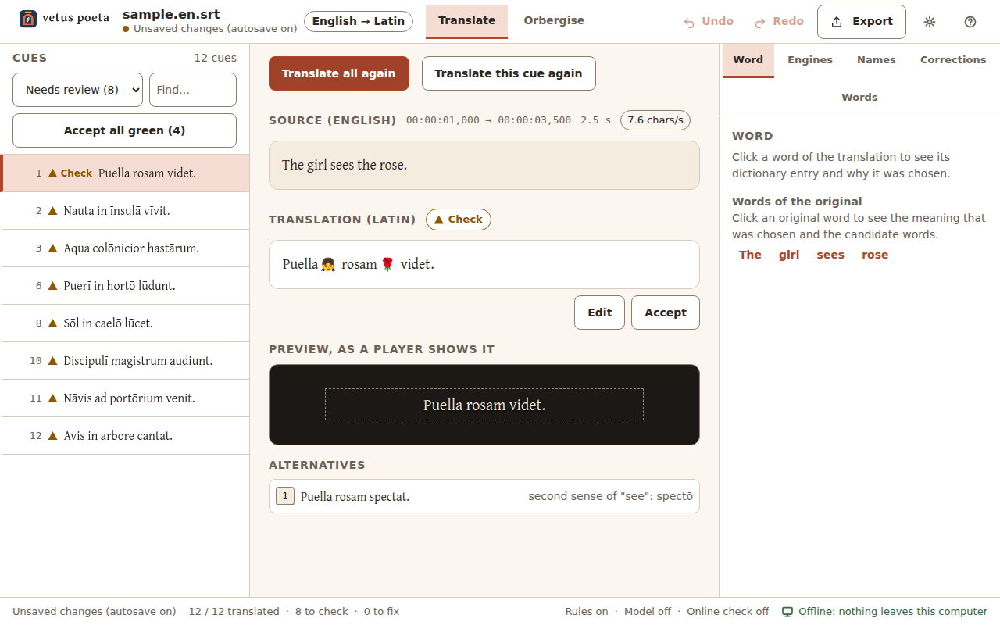
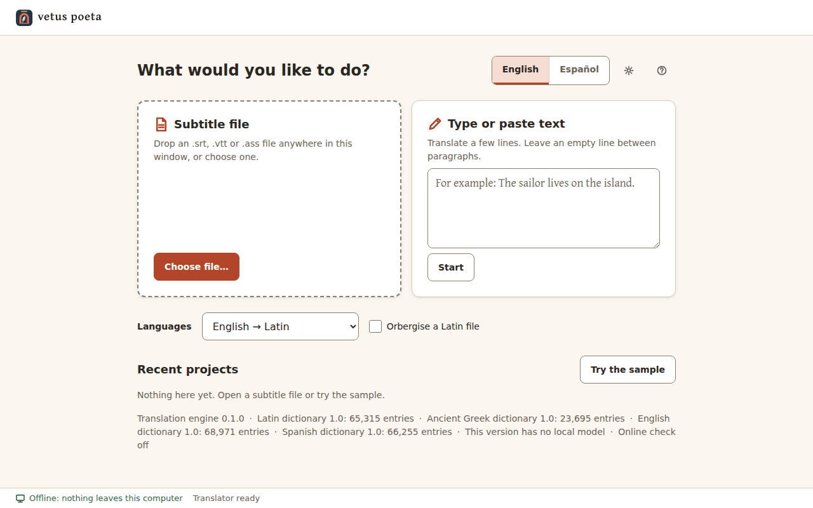
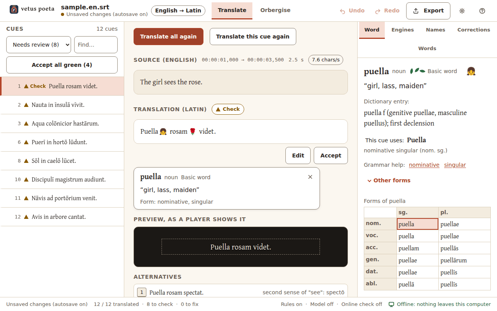
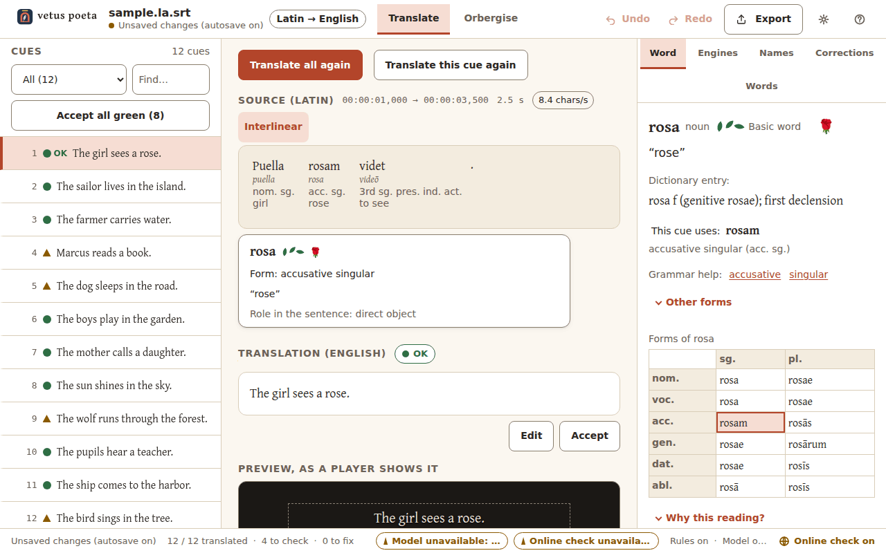
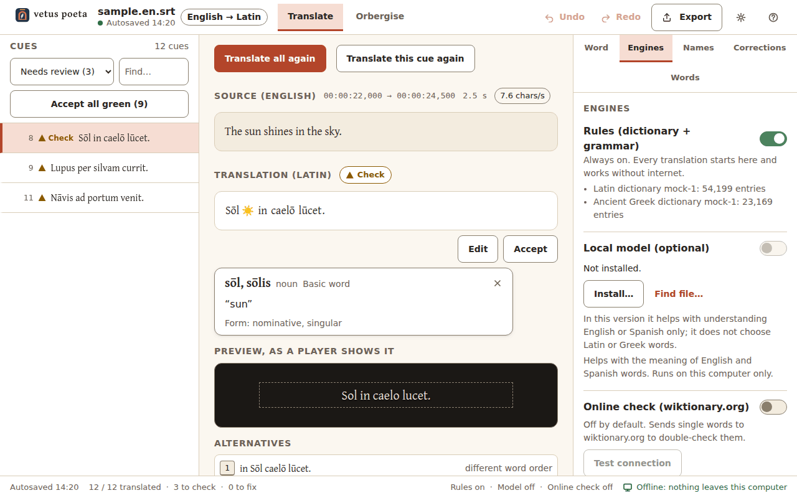
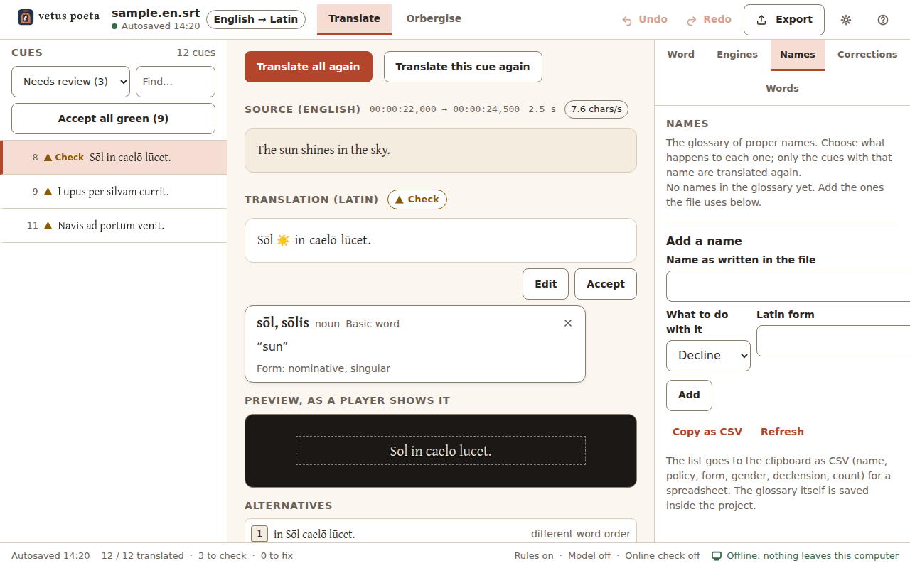
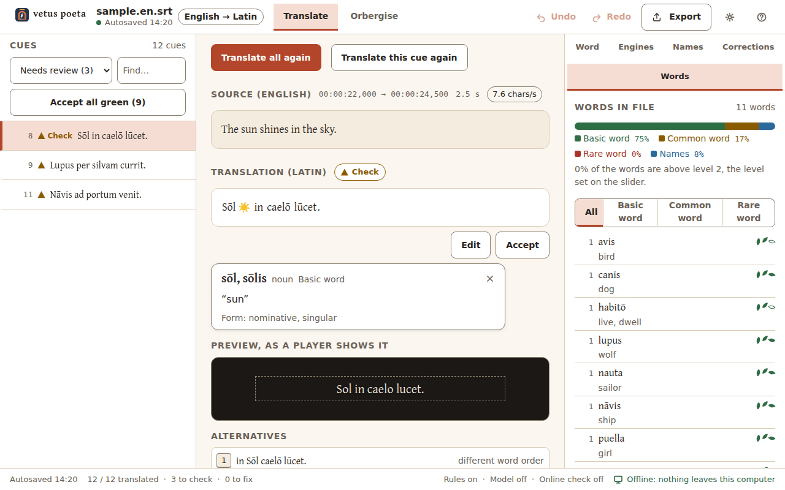
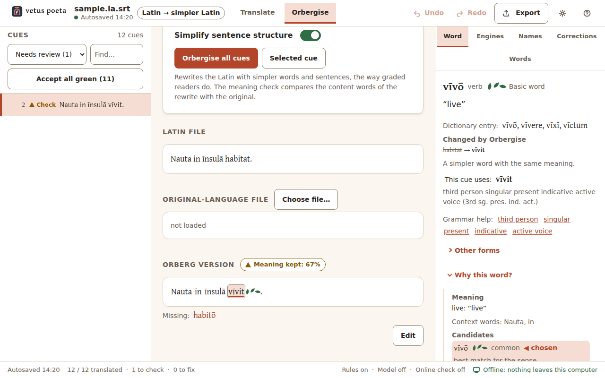
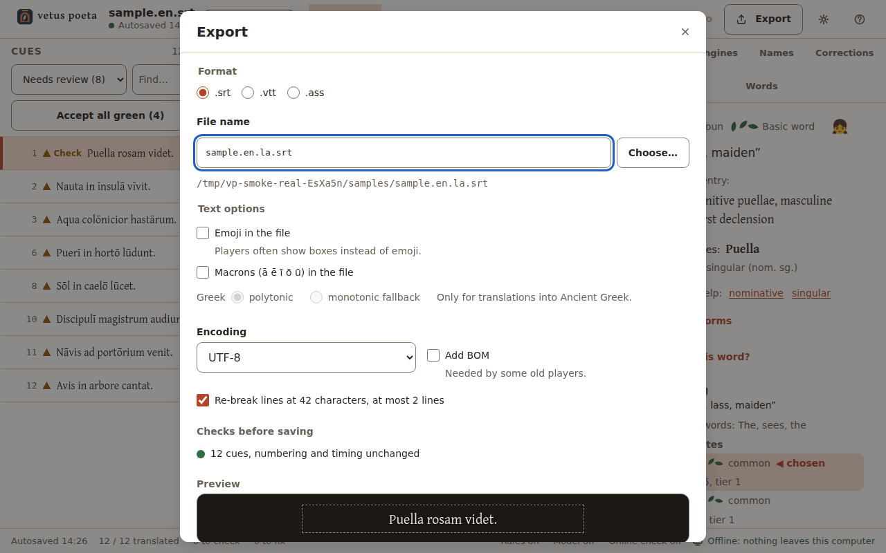
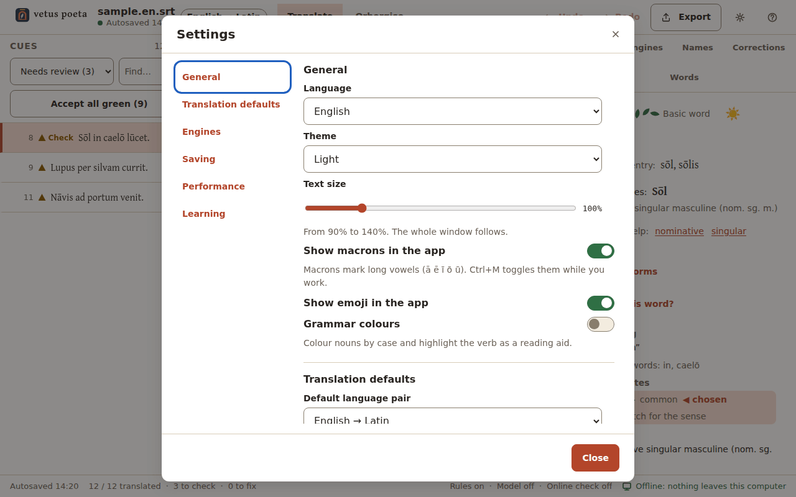

# vetus poeta user guide

*Version 0.1.0 · [Versión en español](USER_GUIDE.es-MX.md)*

vetus poeta translates subtitles and short texts between English or Spanish and Latin, on your own computer, with
no internet. It writes the kind of Latin a first-year reader can follow, and it never guesses silently: every cue
gets a mark that says how sure it is, and every word can tell you why it was chosen. It is made for a Latin
teacher and the students in the class.



*The workspace with the built-in sample, English to Latin, real translation engine. Cue 3 shows why review matters:
"The farmer carries water." came out wrong, and the engine marked it Check (triangle) instead of OK.*

## Contents

1. [What vetus poeta does](#1-what-vetus-poeta-does)
2. [Installing](#2-installing)
3. [The start screen](#3-the-start-screen)
4. [The workspace](#4-the-workspace)
5. [The Word tab and "Why this word?"](#5-the-word-tab-and-why-this-word)
6. [Latin to English or Spanish: the interlinear view](#6-latin-to-english-or-spanish-the-interlinear-view)
7. [The Engines tab and the fidelity slider](#7-the-engines-tab-and-the-fidelity-slider)
8. [Names, corrections and the words in the file](#8-names-corrections-and-the-words-in-the-file)
9. [Orbergise mode](#9-orbergise-mode)
10. [Text mode](#10-text-mode)
11. [Export](#11-export)
12. [Settings](#12-settings)
13. [Saving, autosave and recovery](#13-saving-autosave-and-recovery)
14. [Keyboard shortcuts](#14-keyboard-shortcuts)
15. [Troubleshooting](#15-troubleshooting)
16. [The offline guarantee](#16-the-offline-guarantee)
17. [Minimum hardware](#17-minimum-hardware)
18. [Data sources and licences](#18-data-sources-and-licences)

## 1. What vetus poeta does

Two main jobs:

- **Subtitles into Latin.** Open an English or Spanish subtitle file (`.srt`, `.vtt`, `.ass`) and get a Latin one.
  Numbering, timing and styling codes (`<i>`, `{\an8}`, ASS override blocks) are copied byte for byte; only the
  text lines change. Lines are re-broken for the screen (42 characters, at most 2 lines).
- **Latin into English or Spanish.** Open a Latin file or paste Latin text and get a readable translation plus an
  **interlinear view**: under each Latin word, its dictionary form, its form in words and its meaning.

What is ready in version 0.1.0:

| Language pair | State |
|---|---|
| English → Latin, Spanish → Latin | ready |
| Latin → English, Latin → Spanish | ready |
| English/Spanish → Ancient Greek, Ancient Greek → English/Spanish | not yet: listed as "not available" in the picker |
| Orbergise (Latin → simpler Latin) | not yet: the screen exists, the engine answers "cannot orbergise yet" |

**How good is it?** Honest numbers, all measured on the build machine on 2026-10-06:

- On our own 114-sentence English dialogue file the Latin matches the reference translation in 114 of 114 cues
  (110 before four of the engine's answers were accepted as alternative reference translations), and on its
  100-sentence Spanish twin in 97 of 100 (the last 3 were then accepted the same way). **These files were used to
  tune the rules**, so they flatter the engine.
- Latin → English and Latin → Spanish: 125 of 125 of our own test sentences are right in both languages, again
  after tuning; a batch of 30 sentences written later came out right in 20 of 30 on its first run.
- On texts the engine has never seen it will do worse. That number (the held-out test) has **not been measured
  yet**, and the teacher's own film file, the real acceptance test, has not arrived yet.
- A side-by-side with Google Translate is planned but not done yet.

So treat every translation as a draft to review. The marks in the cue list tell you where to look first.

## 2. Installing

vetus poeta is a portable folder; there is no installer. Copy `vetus-poeta` anywhere (for example
`C:\Programs\vetus-poeta`) and start **VetusPoeta.exe**. What is inside:

```
VetusPoeta.exe        the window                     vpengine.exe          the translator
WebView2Loader.dll    needed by the window           ui\                   the interface
data\*.vpl            Latin, Greek, English and Spanish dictionaries (about 206 MB)
data\nlp\             English and Spanish sentence analysers         data\curated\   word tables
samples\              the sample files (our own sentences)          models\         the optional model
THIRD_PARTY_NOTICES.txt  every licence                               licenses\
```

The whole folder is about 240 MB without the model.

- **Microsoft Edge WebView2 Runtime.** The window is drawn by it. Windows 10 (updated) and Windows 11 already have
  it. If it is missing, vetus poeta says so and offers to open Microsoft's download page; that is the only time it
  opens a web page by itself. The "Standalone" x64 installer from Microsoft also works on a computer without
  internet.
- **Dictionaries.** The four `.vpl` files must stay in `data\`. If the Latin one is missing, the start screen shows
  a red card with the exact path it expected.
- **Optional local model.** One file, `Qwen2.5-0.5B-Instruct-Q4_K_M.gguf`, 397,808,192 bytes (about 400 MB),
  licence Apache-2.0. Your teacher or the download page gives it to you; vetus poeta never downloads it. Put it in
  `models\` next to `vpengine.exe`, or anywhere and pick it with **Find file…** in the Engines tab. The app checks
  its SHA-256 fingerprint (`6eb923e7d26e9cea28811e1a8e852009b21242fb157b26149d3b188f3a8c8653`) and shows the result
  in Settings > Engines; another file is refused. Everything works without it.
- **Your own files** (settings, autosaves, log, online cache) live in `%LOCALAPPDATA%\vetus-poeta\`.

## 3. The start screen



- **Subtitle file**: drop an `.srt`, `.vtt` or `.ass` file anywhere on the window, or **Choose file…**.
  A `.txt` file or a saved project (`.vpoeta`) opens too.
- **Type or paste text**: a few lines for a quick translation (see [Text mode](#10-text-mode)).
- **Languages**: the pair, for example *English → Latin*. Pairs that are not ready are listed under the picker
  with the reason, so students can see what is coming.
- **Orbergise a Latin file**: the switch for [Orbergise mode](#9-orbergise-mode).
- **Recent projects** (up to 20) and **Try the sample**: a 12-cue file of our own sentences to explore with.
- **English | Español** switches the interface language at once; the gear opens Settings; **?** opens the
  shortcuts, the tour and About.
- The status line at the bottom lists the translator, each dictionary, the model and the online check.

After a crash you see **We found work from your last session.** with **Recover** (the default) and
**Keep the saved version**.

## 4. The workspace

- **Top bar**: the file name and save state, the language pair, the **Translate | Orbergise** tabs, **Undo**,
  **Redo**, **Export**, the settings gear and **?**. Clicking the wordmark closes the project.
- **Cue list** (left): number, mark and first line of each cue. The filter shows **All**, **Needs review**,
  **To fix only**, **Edited by me**, **With emoji**, **Over reading speed** or **Unknown names**; **Find…** searches
  source and translation with or without macrons. **Accept all green (n)** accepts every OK cue at once (with Undo).
- **Source** (centre top): the original cue with its timing, duration and characters per second. Formatting codes
  show as small grey chips; they are kept as they are. Click a source word to see which meaning was used.
- **Translation**: each word is clickable. **Edit** (or `E`) turns it into a text box: `Esc` cancels,
  `Ctrl+Enter` keeps your change, unknown words get a red underline. **Accept** (`Enter`) marks the cue reviewed.
- **Preview, as a player shows it**: the cue as the exported file will look (Export settings: macrons, emoji,
  line breaks), with a warning for lines over 42 characters or a cue that is too fast to read.
- **Alternatives**: up to 3 other wordings with a reason ("simpler words", "different word order", "from your
  corrections"...). Press `1`, `2` or `3` to use one; the previous text becomes an alternative, so nothing is lost.
- **Status bar**: save state, how many cues are translated, to check and to fix, which engines are on, and the
  network indicator **Offline: nothing leaves this computer** (or **Online check on**, amber).

**The three marks** (shape, colour and word, never colour alone):

| Mark | Meaning |
|---|---|
| ● green circle, **OK** | every word known, every check passed, no doubt above the threshold |
| ▲ yellow triangle, **Check** | worth a second look: two plausible meanings, a guessed name or addressee, a sentence the analyser had to repair, a reading-speed problem, a rare word where a core one existed |
| ■ red square, **Fix** | probably wrong: an unknown word, a failed agreement or case check, a source sentence not understood |

**Review flow.** After **Translate**, the list opens on the first cue that needs review. Move with `↓`/`↑` (or `J`/`K`),
`Ctrl+↓` jumps to the next cue to review, `Enter` accepts, `Shift+Enter` accepts and jumps on. When nothing is
left the app says **All cues checked. Export?** Cues you edited or accepted are never overwritten by a new
translation run; after an engine change the others get a grey dot ("out of date") until you translate again.

## 5. The Word tab and "Why this word?"



Click any Latin word (or press `Space` on it). A small card shows the dictionary form, the meaning and the form;
the **Word** tab on the right shows more:

- the headword with macrons, part of speech, word level (three laurel leaves: **Basic word**, two: **Common word**,
  one: **Rare word**) and an emoji for picturable nouns;
- **Dictionary entry**, **This cue uses:** with the form in words first and the abbreviation second ("accusative
  singular (acc. sg.)"), and **Grammar help** links with one paragraph per term;
- **Other forms**: the full table with the form used in this cue highlighted;
- **Why this word?** (`W`), always the same four blocks: **Meaning** (which sense of the English or Spanish word,
  and the context words used), **Candidates** (the words considered, with level and frequency; the chosen one
  marked), **Form** (why this case, number, person...), **Evidence** (Wiktionary, Whitaker's Words, local model,
  online check: agrees, does not agree, off). Below it, the checks of the cue (known form, agreement, case after
  the verb or preposition, word level, nothing left out, reading speed...). Every line comes from the engine;
  nothing is invented by the window;
- **Use another word** (pick a candidate; the cue stays Check until checked again) and **Add to my corrections**.

## 6. Latin to English or Spanish: the interlinear view



Choose *Latin → English* or *Latin → Spanish* and open a Latin file (the sample works too). The source pane gets an
**Interlinear** button (`Ctrl+I`): under each Latin word you see its dictionary form, its form ("acc. sg.") and its
meaning. Click a Latin word for its role in the sentence (subject, direct object...) and **Why this reading?**, which
shows how the word was read, the other readings the form allows and how sure the engine is. The first alternative of
each cue is a word-by-word line.

## 7. The Engines tab and the fidelity slider



*Practice-engine screenshot: the dictionary sizes are made up.*

- **Rules (dictionary + grammar)**: always on. Every translation is written here, the same way every time
  (same file and same settings give the same output, byte for byte).
- **Local model (optional)**: a small language model that runs on this computer, loaded only during a
  translation and unloaded after. **In this version it helps with understanding English or Spanish only; it does
  not choose Latin or Greek words.** It answers closed questions, such as which dictionary meaning of an English
  word fits the sentence, and it never writes Latin. We tested whether it could tell a correct Latin sentence from
  a broken one: it chose right in 74.9 % of 1,000 pairs, just under the 75 % bar set before the test, so it is not
  used on the Latin side. With the model, translation is much slower; it has not been timed on an i3 yet.
- **Online check (wiktionary.org)**: off by default. When on, the engine looks up the dictionary form of single
  Latin words on wiktionary.org and adds the answer to **Evidence**. It never changes your text; it can only lower
  a mark to Check. Turning it on shows **What leaves the computer** once. It needs two switches: this one and
  **Ask wiktionary.org** in Settings > Engines. **Test connection** tries it.

**How close to the original?** The slider has three stops. It changes which words the engine may use; it never
trades away the meaning.

| Stop | What it changes |
|---|---|
| **Extremely faithful: any word needed** | the whole dictionary, so the exact word can be chosen, even a rare one |
| **Balanced: common words** (default) | common classical words; rarer words are avoided |
| **Flexible: basic words, may rephrase** | basic (Familia Romana level) words, and the sentence may be rephrased |

Two cues from our test file, as the engine translated them on 2026-10-06:

| Source | Extremely faithful | Balanced | Flexible |
|---|---|---|---|
| Pass me the red paint. | Dā mihi pīgmentum rubrum. | Dā mihi colōrem rubrum. | Dā mihi colōrem rubrum. |
| You must be, or you wouldn't be here. | Certē es; aliter hīc nōn essēs. | Certē es; aliter hīc nōn essēs. | Certē es; aliter hīc nōn es. |

On that 114-cue file, 13 cues change between the first two stops and 1 between the last two; Balanced gave the most
OK marks (69, against 53 and 43). A line under the slider states the effect in numbers.

- **Emoji after picturable nouns (in the app)**: an emoji only after a noun with one clear picture (🌹 after
  *rosam*); none when the noun has several meanings. `Ctrl+E` hides or shows them.
- **Macrons in the exported file**: the Export default. In the app macrons are shown unless you hide them
  (`Ctrl+M`).
- **Translate again**: **Selected cue** or **All cues**. Cues you edited or accepted are kept as they are.

## 8. Names, corrections and the words in the file



- **Names**: the glossary of proper names. **Add a name** as written in the file and choose **Keep** (as in the
  source), **Decline** (Latin endings: Marcus, Marcī) or **Translate**, with a Latin form, gender and declension.
  **Apply** re-translates only the cues that contain the name. **Copy as CSV** puts the list on the clipboard.
- **Corrections**: after you edit a cue, the app asks **Remember this change?** **This phrase** stores
  "source phrase → your Latin" and applies it before the rules on later cues (the reason then says
  **From your corrections**); **Just this cue** keeps the edit in that cue only. The tab lists each correction with how many times it
  was applied, and **Remove** (with Undo). Corrections are saved in the project.
- **Words**: the vocabulary of the translation, by frequency, with level badges, a bar of how many words are basic,
  common, rare or names, and how many are above the level set on the slider. **Copy as list** or **Copy as CSV**
  (dictionary form, meaning, level, count) to paste into a spreadsheet or a flashcard app.



## 9. Orbergise mode

> Not available in version 0.1.0: the screen is finished, the engine part is not. The screenshot is from the
> practice engine, with made-up output.

Orbergise rewrites a Latin text the way graded readers do (in the style of Hans Ørberg's *Lingua Latina*): rarer
words become basic or common ones (**Word level**: Basic T1 or Common T2), and with **Simplify sentence
structure** on, long constructions become short main clauses (no ablative absolute, no gerundive, no supine,
indicative where possible). **Keep names** leaves names alone. If you add the **Original-language file** (the
English or Spanish subtitles the Latin came from), the rewrite starts from the original's meaning. Each changed
word is underlined; clicking it shows "was → now" and why (simpler word, simpler structure). The **Meaning kept**
chip compares the content words with the input and lists what is missing; under 60 % the cue is marked Check.



## 10. Text mode

**Type or paste text** on the start screen opens the same workspace without timing: each paragraph (separated by
an empty line) is one item in the list, so there is no reading speed. Everything else works the same (marks,
Word tab, Engines, corrections). Export writes a `.txt` file. Use it to check homework sentences or translate a short
Latin passage.

## 11. Export



**Export** (`Ctrl+Shift+E`) writes a new file; your original is never changed. The file name gets the language code
before the extension (`film.en.la.srt`), and an existing file is replaced only after you confirm.

- **Format**: the original's format is chosen; keeping it copies numbering, timing and layout byte for byte.
- **Emoji in the file**: off by default (players often show boxes instead of emoji).
- **Macrons (ā ē ī ō ū) in the file**: off by default; many viewers expect plain letters.
- **Greek**: polytonic or **monotonic fallback**, only for translations into Ancient Greek (not in this version).
- **Encoding**: UTF-8 (recommended), UTF-16 LE, or Windows-1252 (Latin letters only: macrons and Greek letters
  become `?`). **Add BOM** for some old players.
- **Re-break lines at 42 characters, at most 2 lines**: on by default.
- **Checks before saving**: the cue count with "numbering and timing unchanged", cues faster than the reading speed
  (**Show them**), cues still marked Fix (**Review first**; to export anyway you must tick
  **Export with n cues to fix**). Warnings never block the export.
- **Preview**: the first cues as a player shows them. After exporting, **Reveal file** opens the folder.

## 12. Settings



The gear (`Ctrl+,`) opens one page; every change applies at once, and **Reset to defaults** is at the end.

- **General**: language, theme (Auto, Light, Dark), text size 90-140 %, show macrons, show emoji, grammar colours.
- **Translation defaults**: default language pair, default closeness to the original, export defaults.
- **Engines**: the model file, its size, the SHA-256 check, last load time, **Test model**, **Unload now**;
  **Allow the online check** and **Ask wiktionary.org**.
- **Saving**: autosave, **Open projects folder**, **Recover from last crash**.
- **Performance**: **Eco mode** (2 threads, model unloaded after each job) and **Free memory now**.
- **Learning**: reading speed for adults (17 characters per second) and children (20), and **Reset the tour**.

## 13. Saving, autosave and recovery

A project (`.vpoeta`) holds the cues, your edits and review marks, the names and the corrections. Autosave is on:
a few seconds after each change, at most every minute while you keep working. `Ctrl+S` saves now (the first time it
asks for a file name). Saving writes a new file and then swaps it in, so a power cut never leaves half a project.
If the translator stops, the window restarts it and reopens the project: **The translator restarted. Your work is
safe.** If a project file is damaged, the app offers the last autosave.

## 14. Keyboard shortcuts

Shortcuts without `Ctrl` do not fire while you type in a text box. Press `F1` or `?` for this list in the app.

| Keys | Action |
|---|---|
| `Ctrl+O` / `Ctrl+N` / `Ctrl+S` | Open a file / New project / Save now |
| `Ctrl+Shift+E` | Export |
| `Ctrl+Z` / `Ctrl+Y` or `Ctrl+Shift+Z` | Undo / Redo |
| `↓` or `J` / `↑` or `K` | Next cue / Previous cue |
| `Ctrl+↓` / `Ctrl+↑` | Next / previous cue to review |
| `Ctrl+F` | Search cues |
| `Enter` / `Shift+Enter` | Accept / Accept and go to the next cue to review |
| `E` / `Esc` / `Ctrl+Enter` | Edit / Cancel editing / Accept the edit |
| `1` `2` `3` | Choose alternative 1, 2, 3 |
| `Space` | Open the word inspector |
| `W` | Show or hide "Why this word?" |
| `Ctrl+M` / `Ctrl+E` | Show or hide long-vowel marks / emoji |
| `Ctrl+I` | Interlinear lines under a Latin or Greek source |
| `F1` or `?` | Help and shortcuts |
| `Ctrl+,` | Settings |

## 15. Troubleshooting

| What you see | What to do |
|---|---|
| "vetus poeta needs Microsoft Edge WebView2" | Install the WebView2 Runtime (Evergreen) from Microsoft; the Standalone x64 installer works offline. |
| "vpengine.exe could not be started", "The folder "ui" is missing", "WebView2Loader.dll is missing" | A file was moved out of the folder. Copy the whole `vetus-poeta` folder again. |
| Red card on the start screen, or "The dictionary is missing / is damaged" | The `.vpl` files must be in `data\` next to `vpengine.exe`. Copy the folder again. |
| Model: "Not installed." | Optional. Use **Find file…** in the Engines tab, or put the file in `models\`. |
| Model: "does not match the expected file" | The file is another version or incomplete; get the exact file (size and SHA-256 in [Installing](#2-installing)). |
| "This processor cannot run the local model" | The model needs a processor with AVX2. The rules keep working. |
| "The online check did not answer" | Check the internet connection, or leave it off. wiktionary.org sometimes asks clients to wait; the app waits once and then marks the word "no data". |
| "The translator restarted. Your work is safe." | Nothing to do. If it keeps stopping, the app stops restarting it and names its log file: `%LOCALAPPDATA%\vetus-poeta\logs\engine.log`. Send that file with your report. |
| A Latin word is wrong in many cues | Fix it once, choose **This phrase**, then **Translate again**. For a name, use the Names tab. |
| A cue is marked "Fast" | The Latin is longer than the time allows. Try **Flexible**, choose a shorter alternative, or edit; timing never changes. |
| Strange letters in an old player | Export as UTF-8 with **Add BOM**, or without macrons. |

## 16. The offline guarantee

With the online check off (the default), **nothing leaves this computer**: the rules, the dictionaries, the model
and your files all work with the network unplugged, and the status bar says so. Only two things can ever use the
network, and only after you turn them on:

- the **online check**: one request per Latin word, to `en.wiktionary.org`, carrying only the word's dictionary form
  (no subtitle text, no file names, nothing about you; the server sees your IP address, like any web request).
  Answers are cached in `%LOCALAPPDATA%\vetus-poeta\online-cache\` for 30 days (at most 20 MB; deleting the folder
  is safe). At most one request per second;
- the **WebView2 download page**, opened only if the runtime is missing and you agree.

vetus poeta never downloads the model, never sends usage data and has no account.

## 17. Minimum hardware

The target (decision D4) for all three engines: Windows 10 or 11, 64-bit; an Intel Core i3 with AVX2 (4th
generation or newer) or similar; 4 GB of RAM; integrated graphics (not used); about 800 MB of disk with the model
(the folder is about 240 MB without it, the model about 400 MB). Planned memory use: under 250 MB without the model,
under 1.2 GB with it. These are design targets, measured so far only on the Linux build machine (the engine peaked
at about 140 MB there while translating a 114-cue file in under a second); the app has not yet been timed on an i3.
Without AVX2 everything except the local model works.

## 18. Data sources and licences

The dictionaries are built from Wiktionary (through Kaikki/Wiktextract, CC BY-SA 4.0), Lewis & Short and LSJ from
the Perseus Digital Library (CC BY-SA), the Dickinson College Commentaries core vocabularies (CC BY-SA 3.0) and
Whitaker's Words (used with its author's permission). The sentence analysers are trained on Universal Dependencies
treebanks (UD English-EWT, UD Spanish-GSD and AnCora). The interface uses SIL's Gentium Plus font (SIL Open Font
License 1.1); the program uses llama.cpp (MIT), nlohmann/json (MIT) and miniz (MIT); the optional model is Qwen2.5
0.5B Instruct (Apache-2.0); the window is Microsoft Edge WebView2. The exact notices are in the app under
**? > About vetus poeta > Data sources and licences**, **Software** and **Fonts** (read from the dictionary files
themselves), and in `THIRD_PARTY_NOTICES.txt`. vetus poeta itself is proprietary software
([LICENSE](../LICENSE)).
